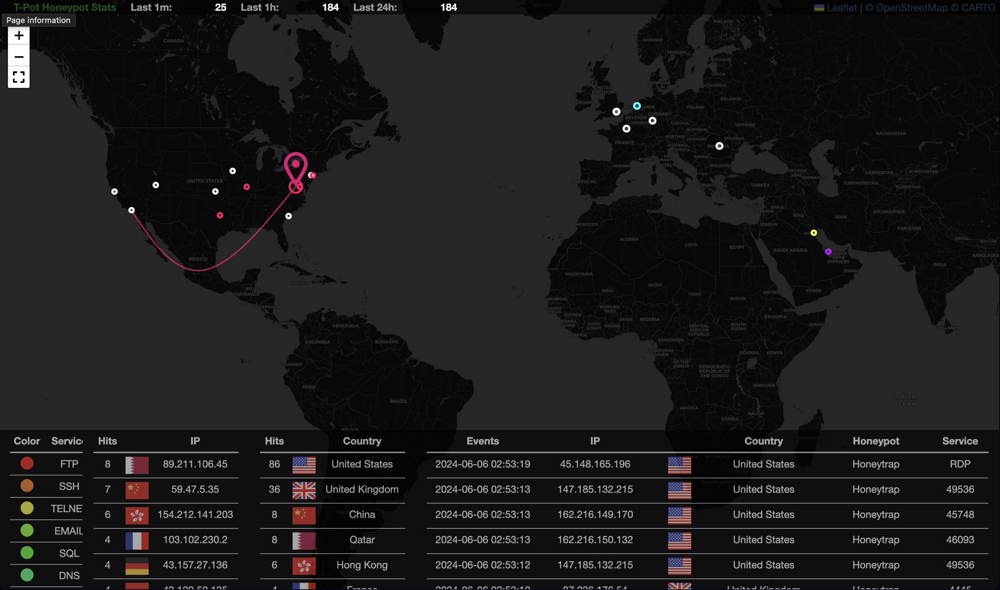

# Azure SEIM Lab
---
This repository contains Terraform code to set up an Azure honeypot environment for Security Information and Event Management (SIEM) lab purposes. The code provisions an Ubuntu virtual machine with various open ports to simulate a vulnerable system and attract potential attackers.

## Prerequisites
---
- Azure subscription
- Terraform installed
- Azure CLI installed
- SSH key pair (public and private keys)

## Usage
---
1. Clone this repository:


2. Navigate to the repository directory:


3. Copy your SSH public key to the `~/.ssh/id_rsa.pub` path or update the `public_key` line in `main.tf` with the path to your public key.

4. Run `terraform init` to initialize the Terraform working directory.

5. Run `terraform apply` to create the Azure resources. Review the execution plan and enter `yes` to confirm.

6. After the deployment is complete, Terraform will output the public IP address and SSH command to connect to the virtual machine.

## Configuration
---
The `variables.tf` file contains the default values for various resources. You can modify these values according to your requirements. For example, you can change the resource group name, location, virtual machine size, and more.

## Usage
---

After Configuration and Deployment, you can connect to the virtual machine using the SSH command provided by Terraform. To find the command run `terraform output`. For example, it will look like this:

- **Login to Web Server:** 
  - Username: `azureuser`
  - Password: `hellohoney`

SSH Command: 
```
ssh azureuser@40.117.199.224
```

SSH Command (After Restart for Honey Install): 
```
ssh -p 64295 azureuser@40.117.199.224
```

VM Public IP: `40.117.199.224`

Web Server Login URL: https://40.117.199.224:64297

--- 


## Cleanup
---
To remove all the created resources, run `terraform destroy` and confirm by entering `yes`.

## Security Considerations
---
This lab environment is designed to simulate a vulnerable system and attract potential attackers for educational purposes. It is recommended to use this setup in a controlled environment and not expose it to the public internet. Additionally, ensure to clean up the resources after completing the lab to avoid any potential misuse.

## License
---
This project is licensed under the [MIT License](LICENSE).
